# Writeup for RWCTF-3rd router3 and real writeup for CVE-2020-14104
[中文版](https://github.com/chaitin/Real-World-CTF-3rd-Challenge-Attachments/blob/main/router3/writeup_zh.md)

I made a challenge named [router3](https://github.com/chaitin/Real-World-CTF-3rd-Challenge-Attachments/tree/main/router3) for [RWCTF-3rd](https://ctftime.org/event/1198). Team [CodeR00t](https://ctftime.org/team/143448) ,[Bushwhackers](https://blog.bushwhackers.ru/) and [Sauercloud](https://twitter.com/Sauercl0ud) solved it during the game, congratulations to them!

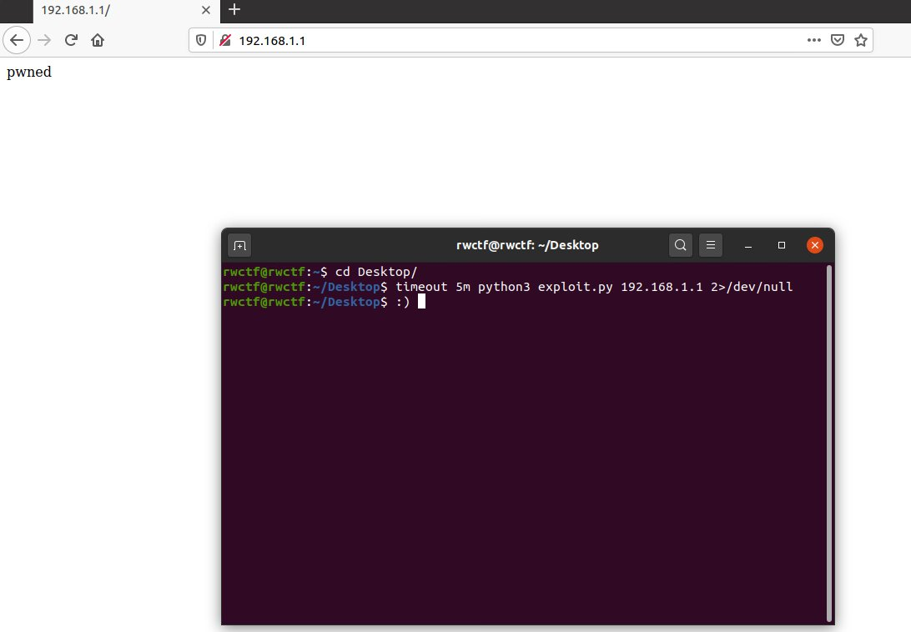

> first blood was taken by `CodeR00t`

Here I want to share the writeup for `router3` and `CVE-2020-14104`(the related vuln)

## Writeup for router3

### information of the challenge

In case the readers didn't participate in `RWCTF-3rd`, I paste the description below:

```
router3
Score: 477

web reverse demo


Geez, you can access some internal and experimental API using an awesome bug now! Try to exploit the [router](https://rwctf2021.s3-us-west-1.amazonaws.com/router3-a2dcb2d91d0654c87ffce982a86b8794723e76d6.tar.gz) completely next!

**root password is not set in the above attachments, but set in the demo environment**
```

And the attachments

```bash
rwctf@rwctf:~/Desktop$ tar tvf router3.tar.gz
-rw-r--r-- root/root 268435456 2021-01-08 04:20 openwrt-armvirt-32-root.ext4
-rwxr-xr-x root/root   1880792 2021-01-08 03:51 openwrt-armvirt-32-zImage
-rw-r--r-- root/root      1838 2021-01-09 20:19 readme.md
-rwxr-xr-x root/root       749 2021-01-08 03:54 start.sh
rwctf@rwctf:~/Desktop$ cat start.sh
#!/bin/sh
IMAGE=openwrt-armvirt-32-zImage
LAN=ledetap0
DRIVE=openwrt-armvirt-32-root.ext4
# create tap interface which will be connected to OpenWrt LAN NIC
ip tuntap add mode tap $LAN
ip link set dev $LAN up
# configure interface with static ip to avoid overlapping routes
ip addr add 192.168.1.101/24 dev $LAN
qemu-system-arm \
    -device virtio-net-pci,netdev=lan \
    -netdev tap,id=lan,ifname=$LAN,script=no,downscript=no \
    -device virtio-net-pci,netdev=wan \
    -netdev user,id=wan \
    -drive file=$DRIVE,format=raw,if=virtio -append 'root=/dev/vda rootwait' \
    -M virt -nographic -m 256 -kernel $IMAGE
# cleanup. delete tap interface created earlier
ip addr flush dev $LAN
ip link set dev $LAN down
ip tuntap del mode tap dev $LAN
rwctf@rwctf:~/Desktop$ file openwrt-armvirt-32-*
openwrt-armvirt-32-root.ext4: Linux rev 1.0 ext2 filesystem data (mounted or unclean), UUID=57f8f4bc-abf4-655f-bf67-946fc0f9f25b (extents) (large files)
openwrt-armvirt-32-zImage:    ARM OpenFirmware FORTH Dictionary, Text length: -509607936 bytes, Data length: -509607936 bytes, Text Relocation Table length: -369098749 bytes, Data Relocation Table length: 24061976 bytes, Entry Point: 0x00000000, BSS length: 1880792 bytes
```

Players are provided with a `qemu-launched` mips-system based on [openwrt](http://openwrt.org/). According to `readme.md`(a long document which describes some details for demo-show), the players are asked to achieve `RCE` or `arbitrary-file-write`, which could be leveraged to `RCE` too. 


Summarize above information:

- What kind of challenge it is?
  - web & reverse

- What we have? 
  - a mips-system
- What we are supposed to do? 
  - full RCE 


**So where the vuln should be? **

Launching this mips-system using `start.sh`(must be root), from the result of `netstat` and `ps`, it's clear that the only process related to `web` is `nginx`.

```bash
root@OpenWrt:/# netstat -antpl
netstat: showing only processes with your user ID
Active Internet connections (servers and established)
Proto Recv-Q Send-Q Local Address           Foreign Address         State       PID/Program name
tcp        0      0 0.0.0.0:80              0.0.0.0:*               LISTEN      935/nginx.conf -g d
......
root@OpenWrt:/# ps
  PID USER       VSZ STAT COMMAND
......
  935 root      2404 S    nginx: master process /usr/sbin/nginx -c /etc/nginx/
  958 root      2452 S    nginx: worker process
......
```

More specifically, it used [luci](https://openwrt.org/docs/techref/luci). 

```bash
root@OpenWrt:~# ls /www/
cgi-bin      index.html   luci-static
root@OpenWrt:~# ls /www/cgi-bin/
cgi-backup    cgi-download  cgi-exec      cgi-upload    luci
```

Basically, **luci = [lua](http://www.lua.org/) + [uci](https://openwrt.org/docs/techref/uci)**. In short, luci uses the Lua programming language and is based on some [MVC](https://en.wikipedia.org/wiki/Model%E2%80%93view%E2%80%93controller)-Webframework.

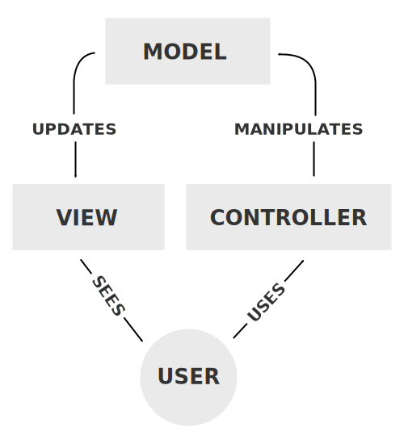

So users can interact with `controller`. Let's focus on the `controller` code, which is located in `/usr/lib/lua/luci/controller`

```bash
root@OpenWrt:~# ls /usr/lib/lua/luci/controller/ -R
/usr/lib/lua/luci/controller/:
admin         api           firewall.lua  opkg.lua

/usr/lib/lua/luci/controller/admin:
index.lua    network.lua  uci.lua

/usr/lib/lua/luci/controller/api:
index.lua   system.lua
```

Compared with standard `openwrt` system, clearly there is an extra file `/usr/lib/lua/luci/controller/api/system.lua` here. Probably it is the code that players should focus on.

So, let's take a look. But wait! Why it's an ELF file?

```bash
rwctf@rwctf:~/Desktop$ file system.lua
system.lua: ELF 32-bit invalid byte order (SYSV)
rwctf@rwctf:~/Desktop$ hexdump -C -n 20 ./system.lua
00000000  7f 45 4c 46 01 00 00 00  00 00 00 00 00 00 00 05  |.ELF............|
00000010  02 00 03 00                                       |....|
00000014
rwctf@rwctf:~/Desktop$ chmod +x system.lua ; ./system.lua
Hello world
```

Should we fire up `IDA pro` or some other decompilers? Of course not, we have known that luci heavily depends on lua. if we have checked `lua` version in the mips-system, we'll immediately realize that the lua binary is modified so the magic ELF header doesn't mean it's a real ELF file.

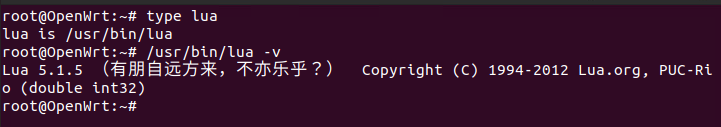


And that's why there is a tag `reverse` for the challenge. Players must do some reverse work and write a decompiler before auditing the lua code. I won't show you how to write a decompiler step by step because there have been lots of resources. But I can provide some good references<sup>[1](https://github.com/feicong/lua_re) [2](https://bbs.pediy.com/thread-216969.htm)</sup>(only in Chinese, sorry) and the [diff file](https://github.com/chaitin/Real-World-CTF-3rd-Challenge-Attachments/tree/main/router3/files/310-rwctf-router3.patch).

Next, let's take a break from the challenge and have a glance at [CVE-2020-11960](https://privacy.mi.com/trust#/security/vulnerability-management/vulnerability-announcement/detail?id=15&locale=en)


### brief introduction to CVE-2020-11960

`CVE-2020-11960`, which I had presented on [HITCON 2020](https://hitcon.org/2020/slides/Exploit%20(Almost)%20All%20Xiaomi%20Routers%20Using%20Logical%20Bugs.pdf), mainly leveraged files left in `/tmp` when the uploading procedure failed, to achieve RCE.

You can check more details from page 33~55 of the slides and I will briefly introduce how I exploited this vuln here, too.

The exploit can be concluded into the following steps:

1. Due to some trival flaws, we can upload two files `/tmp/hack_des.sh` & `/tmp/dnsmasq.d/mbu.conf`, where `hack_des.sh` is a shell script containing arbitrary command and `mbu.conf` is a configuration file for [dnsmasq](http://www.thekelleys.org.uk/dnsmasq/docs/dnsmasq-man.html) with assigning `/tmp/hack_des.sh` as its `dhcp-script`
2. restarting `dnsmasq` to load `mbu.conf`
3. transfer some file via `tftp` and then `hack_des.sh` shall run

The most foremost step is to be able to upload almost arbitrary files to `/tmp`, upon which we can construct the configuration file of `dnsmasq` to achieve RCE.


### Writeup from players

Back to the challenge, there are not many interfaces in `system.lua`. The target should be obvious. I paste the related source code of `/api/system/c_upload` as follows:

```lua
-- /usr/lib/lua/luci/controller/api/system.lua
	entry({"api", "system", "c_upload"},              call("cUpload"), (""), 153, 0x09)							<<--- a

function cUpload()
......
    local uploadFilepath = "/tmp/cfgbackup.tar.gz"
......
        local ext = XQBackup.extract(uploadFilepath)
......
end

-- /usr/lib/lua/xiaoqiang/module/XQBackup.lua
local TMPDIR     = "bkcfg_tmp"

function extract(filepath)
    local fs = require("nixio.fs")
    local tarpath = filepath
    if not tarpath then
        tarpath = TARMBUFILE
    end
    if not fs.access(tarpath) then
        return 1
    end

    if os.execute("tar -tzvf "..tarpath.." | grep ^l >/dev/null 2>&1") == 0 then								<<--- b
        os.execute("rm -rf "..tarpath)
        return 2
    end

    if os.execute("tar -tzvf "..tarpath.." | grep -v .des | grep -v .mbu >/dev/null 2>&1") == 0 then			<<--- c
        os.execute("rm -rf "..tarpath)
        return 22
    end

    os.execute("cd /tmp; mkdir "..TMPDIR.."; cd "..TMPDIR.."; tar -xzf "..tarpath.." >/dev/null 2>/dev/null")	<<--- d
    os.execute("rm "..tarpath.." >/dev/null 2>/dev/null")
    if not fs.access("/tmp/"..TMPDIR.."/cfg_backup.des") then													<<--- e.1
        os.execute("rm -rf /tmp/"..TMPDIR)
        return 2
    end
    if not fs.access("/tmp/"..TMPDIR.."/cfg_backup.mbu") then													<<--- e.2
        os.execute("rm -rf /tmp/"..TMPDIR)
        return 3
    end
    os.execute("mv /tmp/"..TMPDIR.."/* /tmp; rm -rf /tmp/"..TMPDIR)												<<--- f
    return 0
end
```

This is a piece of easy-to-understand code snippet, with the following key points:

- **(a)**. The 4th parameter, [order](https://github.com/openwrt/luci/wiki/ModulesHowTo#show-me-the-way-the-dispatching-process), has a value of `9`, which means the interface `/api/system/c_upload` doesn't need authorization, just like the challenge description shows: `you can access some internal and experimental API using an awesome bug now!`

- **(b)**. check if there is a soft(symbolic) link file in the uploaded `.tar.gz ` archive

- **(c)**.  check if the files are having their filename ends with `.des` or `.mbu`

- **(d)**. create a new directory TMPDIR(`bkcfg_tmp`), and do the extraction step in the new directory

- **(e)**. check if `/tmp/bkcfg_tmp/cfg_backup.des` & `/tmp/bkcfg_tmp/cfg_backup.mbu` are released

- **(f)**. move files from `/tmp/bkcfg_tmp/` to `/tmp` then remove `/tmp/bkcfg_tmp`

Part **(c)** is copied from `CVE-2020-11960`. The check here only checks whether the filename contains `mbu` or `des`, rather than ends with `.mbu` or `.des`. You can also check [实战逻辑漏洞：三个漏洞搞定一台路由器](https://zhuanlan.zhihu.com/p/245070099) for the details and again, only in Chinese.

Compared with `CVE-2020-11960`, the extraction is in `/tmp/bkcfg_tmp`. Files won't be released to `/tmp`.  

Let's reflect more on part **(e)** & **(f)**, if we upload an archive, in which there are two files named exactly as `cfg_backup.des` and `cfg_backup.mbu`, the **(e)** part check will pass and files will be moved from `/tmp/bkcfg_tmp` to `/tmp` at part **(f)**. And then the rest exploitation is as same as `CVE-2020-11960`. The following image is the exploit file from `Bushwhackers` .

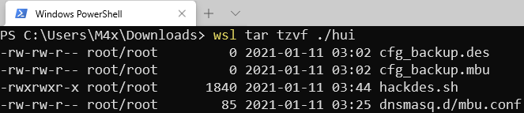

And `Sauercloud` used similar method. 

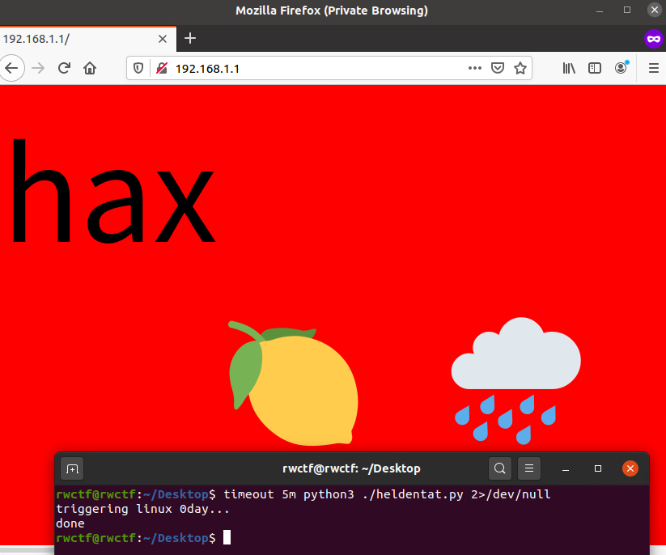


As you may have known, this is not the intended solution because I made some mistakes. But I still want to praise these teams for they solving this challenge in such a short time!

### The unintended solution in the unintended solutions

When hosting a CTF game, we're always willing to see unintended solutions, especially which we can learn from. 

So team `CodeR00t` totally didn't use the `dnsmasq` thing. They chose a different way as the following image shows:

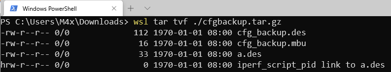

They used [hard link](https://en.wikipedia.org/wiki/Hard_link), which begins with `h` instead of `l` in the result of `tar -tzvf`, to bypass the check of **(b)** to achieve **arbitrary-file-write** in `/tmp`(not almost-arbitrary, literally arbitrary). Then load the content of `iperf_script_pid` into shell command via some other interface. 

> `busybox` simplified most commands. From the result of `tar -tzvf` from `busybox`, we can't even see hardlink file begins with `h`
>
> 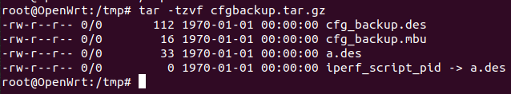

This trick can also be used for `CVE-2020-11960`. Good for you, `CodeR00t`!


## Writeup for CVE-2020-14104

Next, I will introduce the intended solution, AKA, `CVE-2020-14104`, and how I made mistakes. 

`CVE-2020-14104` actually is a partially incomplete fix for `CVE-2020-11960`, where **partially** means it is not an RCE-able vuln now, but there is some flaw in the checks, which can be used to do other damage like LPE. To make this challenge, I modified the logic of `c_upload` by simply copying code from both old and new firmware without more thinking about it. More accurately, I copied code of the extraction but not the checks.

The following code is the new version code with checks(to make `CVE-2020-14104` RCE-able, it's not the same as xiaomi's)

```lua
local TMPDIR     = "bkcfg_tmp"
function extract(filepath)
    local fs = require("nixio.fs")
    local tarpath = filepath
    if not tarpath then
        tarpath = TARMBUFILE
    end
    if not fs.access(tarpath) then
        return 1
    end

    if os.execute("tar -tzvf "..tarpath.." | grep ^l >/dev/null 2>&1") == 0 then								<<--- b
        os.execute("rm -rf "..tarpath)
        return 2
    end

    if os.execute("tar -tzvf "..tarpath.." | grep -v .des | grep -v .mbu >/dev/null 2>&1") == 0 then			<<--- c
        os.execute("rm -rf "..tarpath)
        return 22
    end
    
    ----------------------------------------------------------													<<--- x
    local wcl = io.popen("tar -tzvf "..tarpath.." | wc -l")
    if tonumber(wcl:read("*a")) ~= 2 then
        os.execute("rm -rf "..tarpath)
        wcl:close()
    	return 3
    end   
    wcl:close()
    ----------------------------------------------------------

    os.execute("cd /tmp; mkdir "..TMPDIR.."; cd "..TMPDIR.."; tar -xzf "..tarpath.." >/dev/null 2>/dev/null")	<<--- d
    os.execute("rm "..tarpath.." >/dev/null 2>/dev/null")
    if not fs.access("/tmp/"..TMPDIR.."/cfg_backup.des") then													<<--- e.1
        os.execute("rm -rf /tmp/"..TMPDIR)
        return 2
    end
    if not fs.access("/tmp/"..TMPDIR.."/cfg_backup.mbu") then													<<--- e.2
        os.execute("rm -rf /tmp/"..TMPDIR)
        return 3
    end
    os.execute("mv /tmp/"..TMPDIR.."/* /tmp; rm -rf /tmp/"..TMPDIR)												<<--- f
    return 0
end
```

The `x` part code snippet checks whether there are only 2 files in the archive, which should kick the unintended solution out(I hope so). 

I will give you a minute to try to pwn this new version challenge.

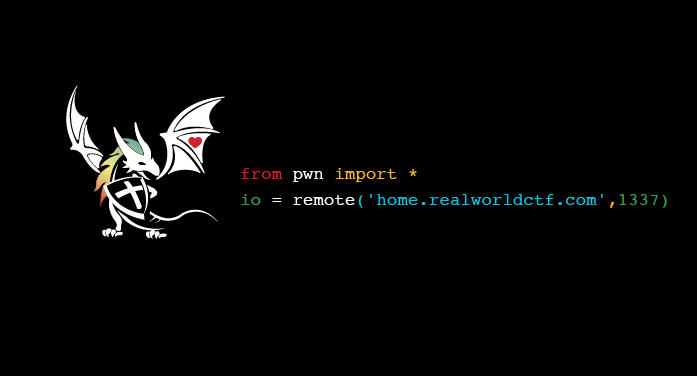


OK, let's continue. When we upload a normal archive(all checks passed), the above steps can be presented as follow:

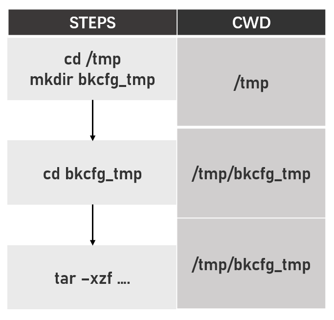

But when some checks failed(for example, there is no `cfg_backup.des`), there will be an extra `rm` operation:

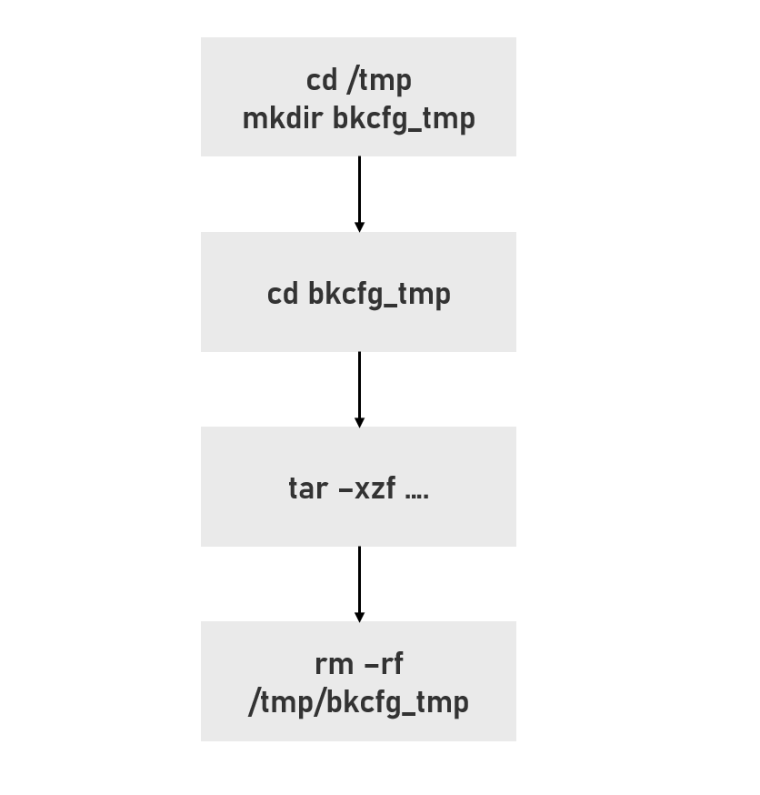

See the problem? If we have two threads T1 and T2, T2's `rm -rf /tmp/bkcfg_tmp` happens right before T1's `cd bkcfg_tmp`, the `cd ` operation of T1 will fail and the actual extraction will be in directory `/tmp/` again

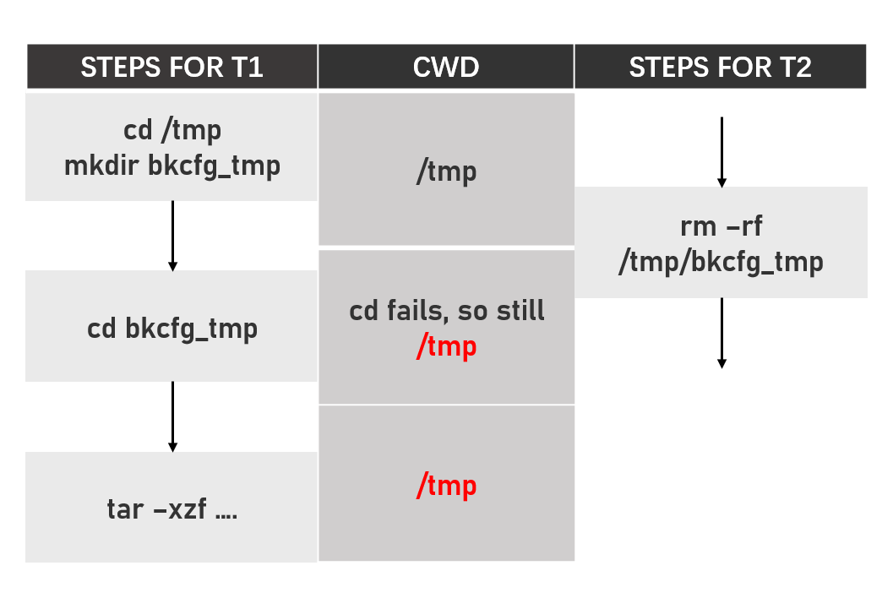

So it's a race-condition bug in the file system. That's why I give teams huge number of times to try for demo(5 minutes * 2 attempts * 5 times).

Plus, for this vuln, too many concurrent requests will have lower success rate because every upload request will do `mkdir` operation at first and change the existence of the directory  `/tmp/bkcfg_tmp`.

And here is my demo-show screenshot!

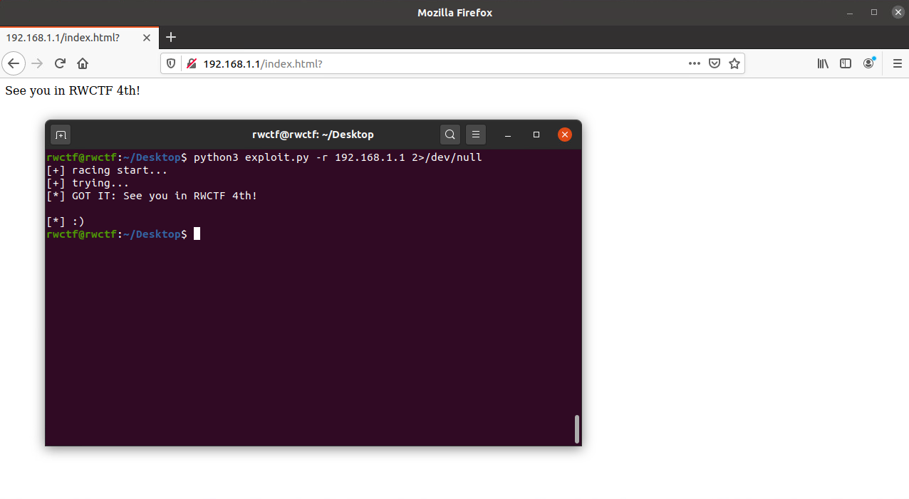

**See you in RWCTF 4th!**

> For those who are curious about how to fix this vuln. Using the `-C` parameter of `tar` should be good.
>
>        -C, --directory=DIR
>               Change to DIR before performing any operations.   This  option  is  order-sensitive,  i.e.  it
>               affects all options that follow.

## Conclusion

1. COVID-19 sucks. We could have had a more wonderful on-site final
2. don't copy & paste code without fully understanding it
3. learning historical vulns is helpful to find new vulns 

Here I want to thank [MiSRC](https://sec.xiaomi.com/) for allowing me to make this challenge upon their vuln. I always hold the opinion that security is the attitude. We have seen many cases that some vendors try to refuse or cover their vulnerabilities deliberately. Vendors shouldn't be afraid of people talking about their vulnerabilities. This only makes their products more secure. MiSRC just set an amazing example for these vendors using an open and positive attitude.

## Reference

[1]. https://github.com/feicong/lua_re

[2]. https://bbs.pediy.com/thread-216969.htm