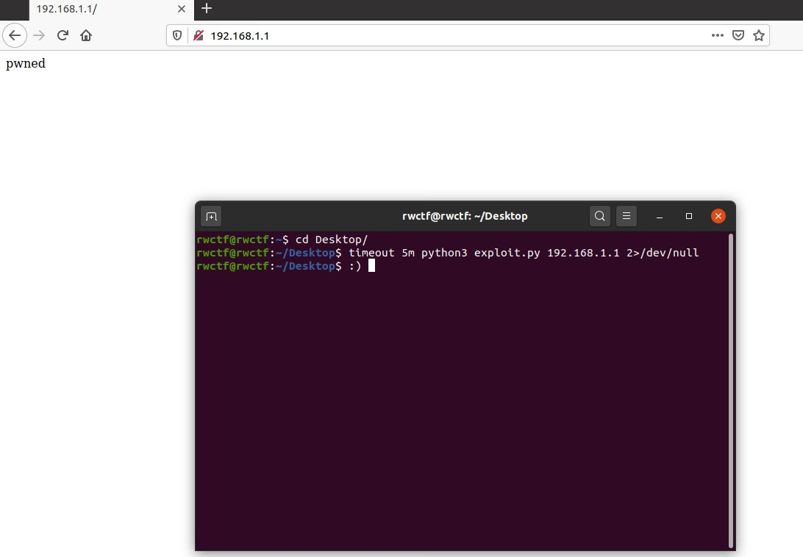
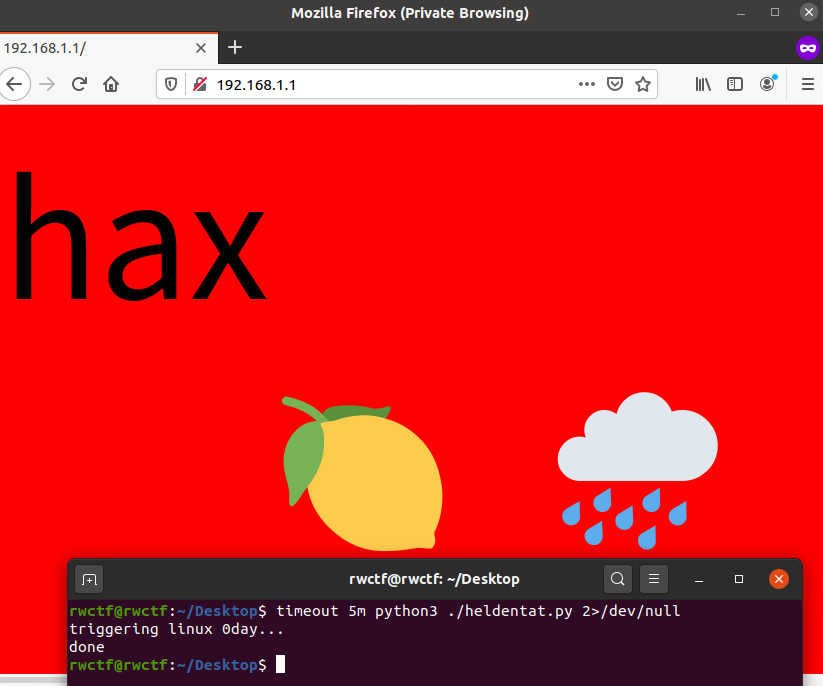
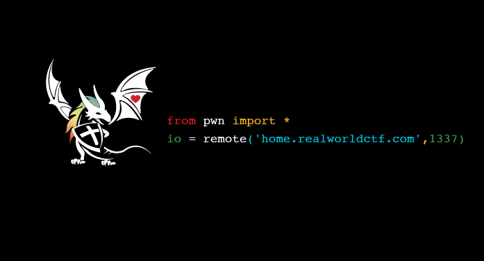
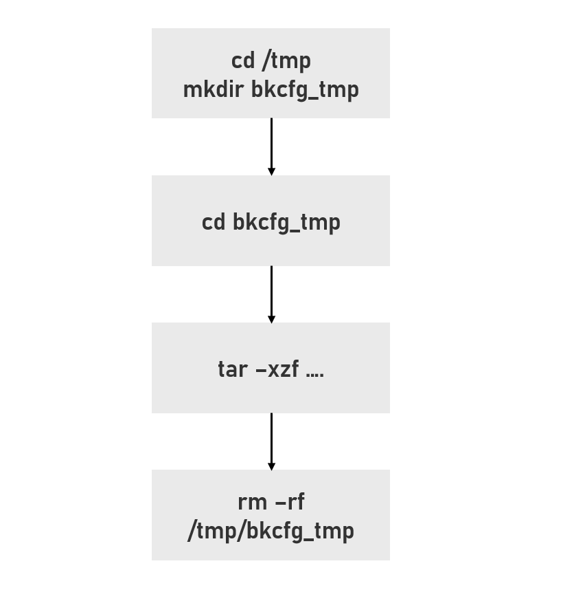
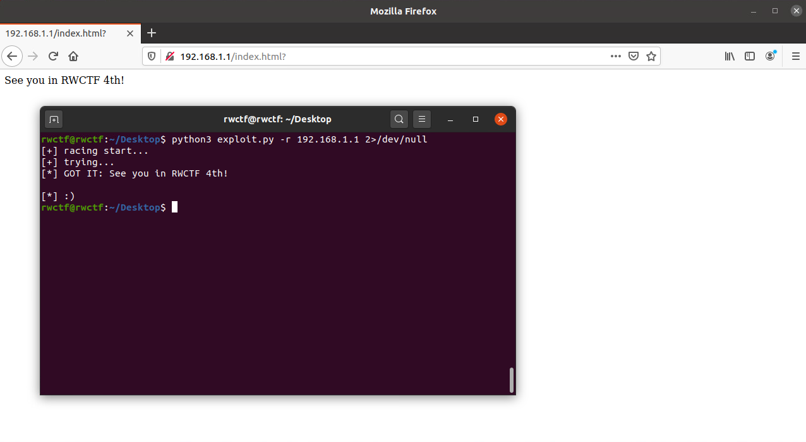

# RWCTF-3rd router3 & CVE-2020-14104 writeup
[English version](https://github.com/chaitin/Real-World-CTF-3rd-Challenge-Attachments/blob/main/router3/writeup.md)

在第三届RWCTF<sup>[1]</sup>中，我出了一道名为router3<sup>[2]</sup>的题目，考察了选手的逆向能力和漏洞挖掘能力。恭喜CodeR00t<sup>[3]</sup>，Bushwhackers<sup>[4]</sup>和Sauercloud<sup>[5]</sup>在比赛中解出了这道题目。



> `CodeR00t`拿到一血

接下来我会分享`router3`和相关漏洞`CVE-2020-14104`的writeup

## Writeup for router3

### 题目信息

`router3`的题目信息如下：

```
router3
Score: 477

web reverse demo


Geez, you can access some internal and experimental API using an awesome bug now! Try to exploit the [router](https://rwctf2021.s3-us-west-1.amazonaws.com/router3-a2dcb2d91d0654c87ffce982a86b8794723e76d6.tar.gz) completely next!

**root password is not set in the above attachments, but set in the demo environment**
```

附件信息如下：

```bash
rwctf@rwctf:~/Desktop$ tar tvf router3.tar.gz
-rw-r--r-- root/root 268435456 2021-01-08 04:20 openwrt-armvirt-32-root.ext4
-rwxr-xr-x root/root   1880792 2021-01-08 03:51 openwrt-armvirt-32-zImage
-rw-r--r-- root/root      1838 2021-01-09 20:19 readme.md
-rwxr-xr-x root/root       749 2021-01-08 03:54 start.sh
rwctf@rwctf:~/Desktop$ cat start.sh
#!/bin/sh
IMAGE=openwrt-armvirt-32-zImage
LAN=ledetap0
DRIVE=openwrt-armvirt-32-root.ext4
# create tap interface which will be connected to OpenWrt LAN NIC
ip tuntap add mode tap $LAN
ip link set dev $LAN up
# configure interface with static ip to avoid overlapping routes
ip addr add 192.168.1.101/24 dev $LAN
qemu-system-arm \
    -device virtio-net-pci,netdev=lan \
    -netdev tap,id=lan,ifname=$LAN,script=no,downscript=no \
    -device virtio-net-pci,netdev=wan \
    -netdev user,id=wan \
    -drive file=$DRIVE,format=raw,if=virtio -append 'root=/dev/vda rootwait' \
    -M virt -nographic -m 256 -kernel $IMAGE
# cleanup. delete tap interface created earlier
ip addr flush dev $LAN
ip link set dev $LAN down
ip tuntap del mode tap dev $LAN
rwctf@rwctf:~/Desktop$ file openwrt-armvirt-32-*
openwrt-armvirt-32-root.ext4: Linux rev 1.0 ext2 filesystem data (mounted or unclean), UUID=57f8f4bc-abf4-655f-bf67-946fc0f9f25b (extents) (large files)
openwrt-armvirt-32-zImage:    ARM OpenFirmware FORTH Dictionary, Text length: -509607936 bytes, Data length: -509607936 bytes, Text Relocation Table length: -369098749 bytes, Data Relocation Table length: 24061976 bytes, Entry Point: 0x00000000, BSS length: 1880792 bytes
```

提供给了选手一个通过qemu启动，基于openwrt<sup>[6]</sup>的mips虚拟机。在`readme.md`中描述了选手的目标是更改`/www/index.html`，也就是需要实现任意文件写或者RCE


总结以上信息：

- 题目类型？
  - web & reverse
- 提供给选手的附件
  - 一个mips虚拟机
- 选手需要达成的目标
  - RCE（任意文件写最终可以转化为RCE）

### 分析题目

题目的标签是`web`和`reverse`。使用`start.sh`启动虚拟机后，通过`netstat`和`ps`的结果可以看出唯一和`web`有关的进程是nginx<sup>[7]</sup>

```bash
root@OpenWrt:/# netstat -antpl
netstat: showing only processes with your user ID
Active Internet connections (servers and established)
Proto Recv-Q Send-Q Local Address           Foreign Address         State       PID/Program name
tcp        0      0 0.0.0.0:80              0.0.0.0:*               LISTEN      935/nginx.conf -g d
......
root@OpenWrt:/# ps
  PID USER       VSZ STAT COMMAND
......
  935 root      2404 S    nginx: master process /usr/sbin/nginx -c /etc/nginx/
  958 root      2452 S    nginx: worker process
.....
```

并且虚拟机中启用了luci<sup>[8]</sup>，

```bash
root@OpenWrt:~# ls /www/
cgi-bin      index.html   luci-static
root@OpenWrt:~# ls /www/cgi-bin/
cgi-backup    cgi-download  cgi-exec      cgi-upload    luci
```

#### luci = lua<sup>[9]</sup> + uci<sup>[10]</sup>

简单来说，luci是一种MVC<sup>[11]</sup>框架，主要使用了Lua语言实现后端（更多的细节请参考官方文档）


在MVC框架中，用户可以直接交互的是`controller`，对应到题目也就是`/usr/lib/lua/luci/controller`部分的代码

```bash
root@OpenWrt:~# ls /usr/lib/lua/luci/controller/ -R
/usr/lib/lua/luci/controller/:
admin         api           firewall.lua  opkg.lua

/usr/lib/lua/luci/controller/admin:
index.lua    network.lua  uci.lua

/usr/lib/lua/luci/controller/api:
index.lua   system.lua
```

与标准的openwrt系统相比较，可以发现题目环境中多了`/usr/lib/lua/luci/controller/api/system.lua`。那么很明显这也就是选手应该关注的代码了。

从文件系统中拿到`system.lua`后可以发现这是一个ELF文件，~~因此启动IDA pro开始逆向~~

```bash
rwctf@rwctf:~/Desktop$ file system.lua
system.lua: ELF 32-bit invalid byte order (SYSV)
rwctf@rwctf:~/Desktop$ hexdump -C -n 20 ./system.lua
00000000  7f 45 4c 46 01 00 00 00  00 00 00 00 00 00 00 05  |.ELF............|
00000010  02 00 03 00                                       |....|
00000014
rwctf@rwctf:~/Desktop$ chmod +x system.lua ; ./system.lua
Hello world
```

之前已经说过`luci`的后端多是由lua实现的，如果我们在虚拟机中查看lua版本的话，立刻就可以发现虚拟机中使用了一个更改过的lua binary


这里也就是题目标签`reverse`所设立的考点了。选手在审计lua代码挖掘漏洞之前，必须先做一些逆向工作找到lua被改了哪些部分并写出反编译器。网上已经有很多详细的教程，我在这里就不再赘述如何一步一步逆向并写反编译器了。在文末有一些参考链接<sup>[11] [12]</sup>和题目中应用的diff文件<sup>[13]</sup>。

### CVE-2020-11960<sup>[14]</sup>

在更进一步分析题目之前，我们先看一下另一个相关的漏洞CVE-2020-11960。我在去年的HITCON会议上展示过该漏洞的挖掘和利用过程（slides<sup>[15]</sup>的33~55页）。这里简要叙述一下如何利用该漏洞：

1. 通过上传文件时文件名检测的不严格上传两个文件`/tmp/hack_des.sh`和`/tmp/dnsmasq.d/mbu.conf`，其中`hack_des.sh`是一个包含了任意命令的shell脚本，`mbu.conf`是dnsmasq<sup>[16]</sup>的配置文件
2. 通过某种方式重启dnsmasq，加载`mbu.conf`
3. 通过`tftp`传输文件，触发`mbu.conf`中指定的`hack_des.sh`

其中后两步是具体的利用，漏洞主要发生在第一步，攻击者首先需要能够在`/tmp`目录下上传包含特殊内容且文件名符合要求的文件。

### 选手writeup

回到题目上。为了节省选手的时间，我删除了大量`system.lua`中的代码，只保留了少部分接口。观察如下`/api/system/c_upload`接口的相关代码

```lua
-- /usr/lib/lua/luci/controller/api/system.lua
	entry({"api", "system", "c_upload"},              call("cUpload"), (""), 153, 0x09)							<<--- a

function cUpload()
......
    local uploadFilepath = "/tmp/cfgbackup.tar.gz"
......
        local ext = XQBackup.extract(uploadFilepath)
......
end

-- /usr/lib/lua/xiaoqiang/module/XQBackup.lua
local TMPDIR     = "bkcfg_tmp"

function extract(filepath)
    local fs = require("nixio.fs")
    local tarpath = filepath
    if not tarpath then
        tarpath = TARMBUFILE
    end
    if not fs.access(tarpath) then
        return 1
    end

    if os.execute("tar -tzvf "..tarpath.." | grep ^l >/dev/null 2>&1") == 0 then								<<--- b
        os.execute("rm -rf "..tarpath)
        return 2
    end

    if os.execute("tar -tzvf "..tarpath.." | grep -v .des | grep -v .mbu >/dev/null 2>&1") == 0 then			<<--- c
        os.execute("rm -rf "..tarpath)
        return 22
    end

    os.execute("cd /tmp; mkdir "..TMPDIR.."; cd "..TMPDIR.."; tar -xzf "..tarpath.." >/dev/null 2>/dev/null")	<<--- d
    os.execute("rm "..tarpath.." >/dev/null 2>/dev/null")
    if not fs.access("/tmp/"..TMPDIR.."/cfg_backup.des") then													<<--- e.1
        os.execute("rm -rf /tmp/"..TMPDIR)
        return 2
    end
    if not fs.access("/tmp/"..TMPDIR.."/cfg_backup.mbu") then													<<--- e.2
        os.execute("rm -rf /tmp/"..TMPDIR)
        return 3
    end
    os.execute("mv /tmp/"..TMPDIR.."/* /tmp; rm -rf /tmp/"..TMPDIR)												<<--- f
    return 0
end
```

有以下关键点：

**(a)**. `/api/system/c_upload`的第四个参数(order<sup>[16]</sup>)是9，即该接口无需认证即可访问（在题目描述中也暗示了这一点：`you can access some internal and experimental API using an awesome bug now`）

**(b)**. 检查上传的`.tar.gz`压缩包中是否有软链接文件

**(c)**. 检查压缩包中文件的文件名是否以`.des`或者`.mbu`结尾

**(d)**. 创建一个新的文件夹`/tmp/bkcfg_tmp`，并在新文件夹下完成解压的步骤

**(e)**. 检查`/tmp/bkcfg_tmp/cfg_backup.des`和`/tmp/bkcfg_tmp/cfg_backup.mbu`是否被释放

**(f)**. 拷贝`/tmp/bkcfg_tmp`下的文件到`/tmp/`，然后删除`/tmp/bkcfg_tmp`


其中**(c)**部分的代码包含与`CVE-2020-11960`一样的缺陷，只检查了文件名中是否包含`des`和`mbu`字符串而非检查是否以`.des`或`.mbu`结尾，关于这一点，也可以参考[实战逻辑漏洞：三个漏洞搞定一台路由器](https://zhuanlan.zhihu.com/p/245070099)。

和`CVE-2020-11960`相比，文件的解压都在`/tmp/bkcfg_tmp`下完成，看起来`CVE-2020-11960`的利用手法在这里不适用。但仔细检查**(e)**和**(f)**部分的代码，如果我们上传一个压缩包，压缩包中刚好有两个文件名为`cfg_backup.mbu`和`cfg_backup.des`的文件，**(e)**处的检查就会通过，进而在**(f)**处，`/tmp/bkcfg_tmp`下的文件又被重新拷贝回`/tmp`。通过构造特殊的压缩包，我们就可以再次获得在`/tmp`目录下上传特殊文件的能力，接下来的利用也就和`CVE-2020-11960`一样了。而比赛中`Bushwhackers`和`Sauercloud`正是使用了这样的方法。


> Bushwhackers的exploit




> Sauercloud的黑页

这种解法并不是预期解，出题的过程中我犯了一些错误导致所有的队伍都使用了非预期解法。但解出题目的队伍在短短48h就写出了反编译器并找到了漏洞，证明了他们身为世界顶级战队的实力。

### 非预期中的非预期

在举办CTF比赛时，我们很乐意看到非预期解，尤其是能让我们学到东西的非预期解法。在比赛中，`CodeR00t`虽然也使用了同一个bug，但他们完全没有使用`dnsmasq`相关的利用手法，而是找到了一种新的利用思路。


上图是`CodeR00t`的exploit，他们使用了硬链接<sup>[17]</sup>来绕过**(b)**处的检查，在`tar -tzvf`的结果中，硬链接以`h`开头，而**(b)**处只检查了是否以`l`开头。**(b)**处的检查绕过后，利用硬链接的特性，攻击者可以实现**完整的任意写文件**。

> busybox精简了大量的命令，在虚拟机中使用`tar -tzvf`时甚至看不到硬链接以`h`开头
>
> 

这种利用方法也能用到`CVE-2020-11960`上:P

## Writeup for CVE-2020-14104

接下来我会介绍题目的预期解法以及我如何犯了一个错误导致了非预期解的产生。

`router3`实际上重现了一遍`CVE-2020-14104`，`CVE-2020-14104`是一个`CVE-2020-11960`的**部分**不完整修复。**部分**的意思是该修复方法使得该处不能RCE，但在检查过程中的疏忽导致该漏洞仍然可以造成诸如LPE之类的危害。为了让题目可RCE，我修改了（ctrl^c+ctrl^v）小米代码的部分逻辑，但只拷贝了旧版固件的解压部分代码，而没有拷贝新版固件中的检查部分代码。

下边是带有检查的`/api/system/c_upload`接口代码（与小米原生的逻辑不同）

```lua
local TMPDIR     = "bkcfg_tmp"
function extract(filepath)
    local fs = require("nixio.fs")
    local tarpath = filepath
    if not tarpath then
        tarpath = TARMBUFILE
    end
    if not fs.access(tarpath) then
        return 1
    end

    if os.execute("tar -tzvf "..tarpath.." | grep ^l >/dev/null 2>&1") == 0 then								<<--- b
        os.execute("rm -rf "..tarpath)
        return 2
    end

    if os.execute("tar -tzvf "..tarpath.." | grep -v .des | grep -v .mbu >/dev/null 2>&1") == 0 then			<<--- c
        os.execute("rm -rf "..tarpath)
        return 22
    end
    
    ----------------------------------------------------------													<<--- x
    local wcl = io.popen("tar -tzvf "..tarpath.." | wc -l")
    if tonumber(wcl:read("*a")) ~= 2 then
        os.execute("rm -rf "..tarpath)
        wcl:close()
    	return 3
    end   
    wcl:close()
    ----------------------------------------------------------

    os.execute("cd /tmp; mkdir "..TMPDIR.."; cd "..TMPDIR.."; tar -xzf "..tarpath.." >/dev/null 2>/dev/null")	<<--- d
    os.execute("rm "..tarpath.." >/dev/null 2>/dev/null")
    if not fs.access("/tmp/"..TMPDIR.."/cfg_backup.des") then													<<--- e.1
        os.execute("rm -rf /tmp/"..TMPDIR)
        return 2
    end
    if not fs.access("/tmp/"..TMPDIR.."/cfg_backup.mbu") then													<<--- e.2
        os.execute("rm -rf /tmp/"..TMPDIR)
        return 3
    end
    os.execute("mv /tmp/"..TMPDIR.."/* /tmp; rm -rf /tmp/"..TMPDIR)												<<--- f
    return 0
end
```

**(x)**部分的代码检查了上传的压缩包中是否只有两个文件，理论上应该会缓解上一节介绍的非预期解。

有了以上的基础，我在这里暂停一下看读者能否发现新版代码中的漏洞。



继续分析，当用户上传一个正常的压缩包时，对该压缩包的处理逻辑可以用下图来表示


但如果某些检查没有通过(比如压缩包中没有`cfg_backup.des`)，就会额外有一步`rm`的操作



而多出的这一步`rm`也就是关键点。让我们思考这样一种情况：当虚拟机同时处理多个请求时，若一个请求中的`rm -rf /tmp/bkcfg_tmp`刚好发生在另一个请求的`cd bkcfg_tmp`之前时，因为`/tmp/bkcfg_tmp`已经不存在了，因此`cd`会失败，当前请求的CWD仍然是`/tmp`，整个流程可以用下图来表示


因此通过文件系统中的条件竞争，攻击者再一次获得了在`/tmp`目录下上传特定文件的能力，接下来的利用就可以参考上文介绍的方法了。比赛中为了我给了选手大量的试错机会赢得竞争（5分钟\*2次机会\*5次尝试），但因为所有的队伍都用了非预期解，所以他们都在20秒内就实现了RCE.

下图是我的demo截图：



> 修复该漏洞可以使用`tar`的`-C`参数

>        -C, --directory=DIR
>               Change to DIR before performing any operations.   This  option  is  order-sensitive,  i.e.  it
>               affects all options that follow.

## 总结

1. 因为疫情，本届RWCTF没有决赛，期待明年春暖花开后在第4届RWCTF决赛现场看到各位师傅
2. 在完全理解代码含义之前，不要盲目的复制&粘贴代码
3. 学习历史漏洞可以帮助我们发现新的漏洞

这里我想要感谢MiSRC<sup>[18]</sup>允许我使用他们的漏洞出题。我一直认为评判产品是否安全需要看厂商对待漏洞的态度。历史上我们也看到过某些厂商故意忽略或者掩盖他们漏洞的例子。厂商不应该担心安全从业者讨论他们的漏洞，这只会让他们的产品更安全，在这一点上MiSRC做出了一个很积极开放的榜样。


## Reference

[1]. https://ctftime.org/event/1198

[2]. https://github.com/chaitin/Real-World-CTF-3rd-Challenge-Attachments/tree/main/router3

[3]. https://ctftime.org/team/143448

[4]. https://blog.bushwhackers.ru/

[5]. https://twitter.com/Sauercl0ud

[6]. http://openwrt.org/

[7]. https://openwrt.org/docs/guide-user/services/webserver/nginx

[8]. https://openwrt.org/docs/techref/luci

[9]. http://www.lua.org/

[10]. https://openwrt.org/docs/techref/uci

[11]. https://github.com/feicong/lua_re

[12]. https://bbs.pediy.com/thread-216969.htm

[13]. https://github.com/chaitin/Real-World-CTF-3rd-Challenge-Attachments/tree/main/router3/files/310-rwctf-router3.patch

[14]. https://privacy.mi.com/trust#/security/vulnerability-management/vulnerability-announcement/detail?id=15&locale=en

[15]. https://hitcon.org/2020/slides/Exploit%20(Almost)%20All%20Xiaomi%20Routers%20Using%20Logical%20Bugs.pdf

[16]. https://github.com/openwrt/luci/wiki/ModulesHowTo#show-me-the-way-the-dispatching-process

[17]. https://en.wikipedia.org/wiki/Hard_link

[18]. https://sec.xiaomi.com/